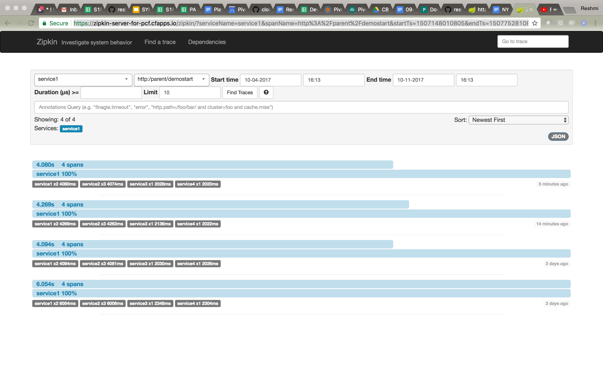
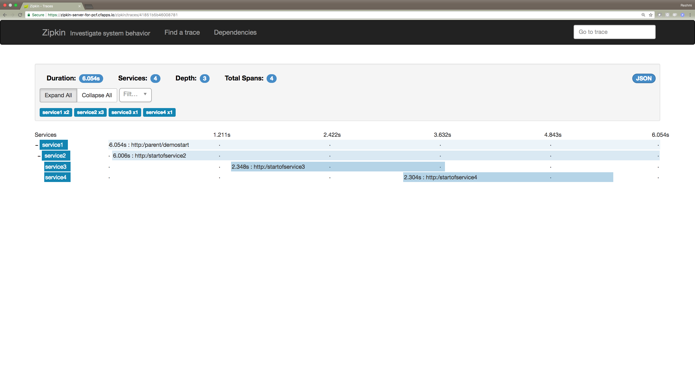
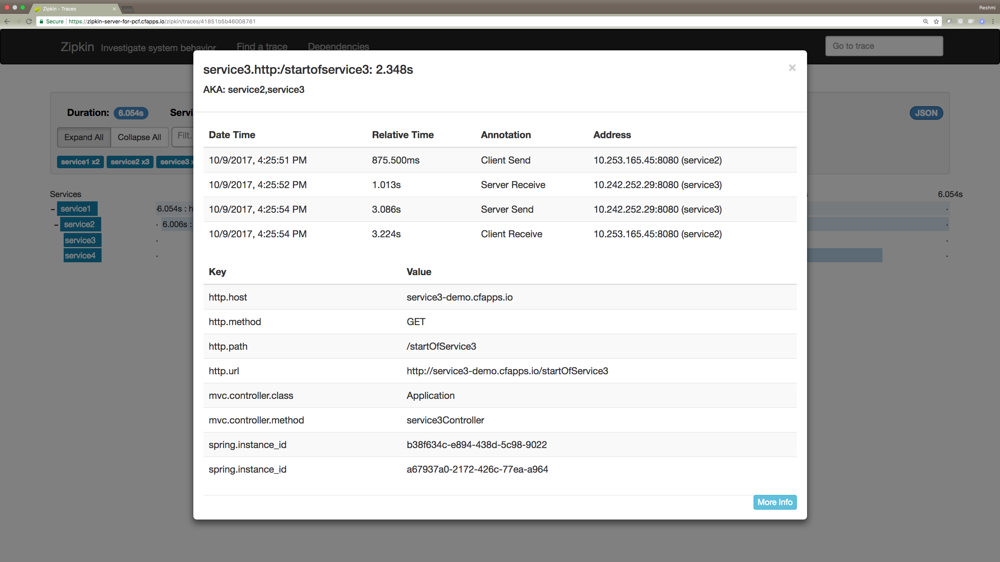
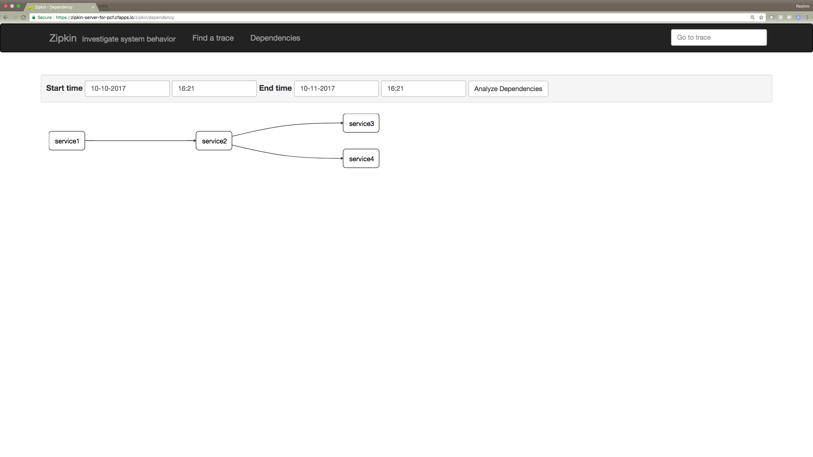
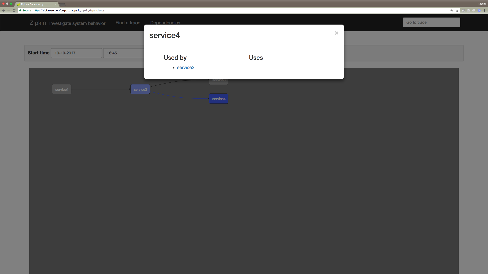

[Instructions if you are using your own environment:]
Once you have deployed these apps in your environment, you should have the following:
1. 4 services running: service1 through service4
2. Zipkin deployed and running. Navigate to deployed zipkin and bring it up on your screen.

[Instructions if you are using my environment-deployed on PWS using Pivotal Cloud Foundry:]

1. Navigate to deployed zipkin here: https://zipkin-server-for-pcf.cfapps.io/zipkin/
2. Navigate to service1 deployed in S1Pdemo12: https://service1-demo.cfapps.io/

[Demo Instructions:]
1. Hit /demostart endpoint on your app: for example mine is here:https://service1-demo.cfapps.io/demostart

2. If everything works fine, then you see a message displayed on your screen that should say: "Hello from Service2. Calling Service3 [Hello from Service3] and then Service4 [Hello from Service4]"

3. Navigate to zipkin and click on service1 from the dropdown for app and click on demostart endpoint.


4. Click on the newest trace you generated, you should see the below trace & span now. This means your request & response has traveled through 4 services in its lifetime. Trace represents the entire journey of a request. Span represents single operation call.


5. Click on a desired span to see the details specifically mvc.controller.class	and mvc.controller.method helps you quickly find the class and method this span represents. Hence, you can now pinpoint the problem by looking at the dashboard.


6. Zipkin also gives you a dependency graph that can help diagnose dependencies for example, by clicking on the apps you will see how many times did 1 app called another one.





[](https://travis-ci.org/spring-cloud-samples/sleuth-documentation-apps)

# Sleuth documentation apps

[Apps used for the Sleuth documentation graphs](http://cloud.spring.io/spring-cloud-sleuth/spring-cloud-sleuth.html) . They're not using
service discovery so don't treat them as reference production applications ;)

The apps are sending spans to Zipkin via RabbitMQ and `spring-cloud-sleuth-stream`.

# Running acceptance tests of CF

Run:

```
./runAcceptanceTests.sh
```

# Running the apps locally with RabbitMQ

Provide the env variable `DEFAULT_HEALTH_HOST` pointing to your Docker Machine. By default it will be `localhost`.
That way we'll start a RabbitMQ instance for you.

Run:

```
./scripts/start_with_zipkin_server.sh
```
